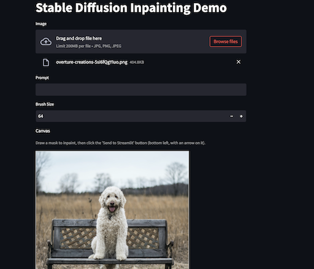
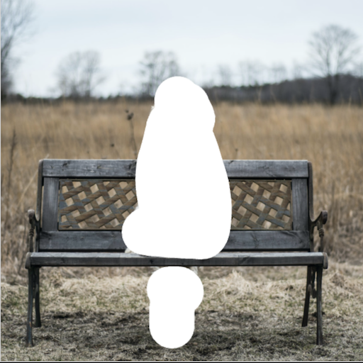

# Build an app for Stable Diffusion inpainting using streamlit, Cloud Run and VertexAI

## Overview

This project demonstrates how you can use streamlit to build an app that interacts with [Stable Diffusion inpainting model](https://huggingface.co/runwayml/stable-diffusion-inpainting) deployed on VertexAI endpoint.

### UI


### Input Image


### Mask


### Output Image


## Prerequisites

1. Follow the steps provided in the [notebook](https://github.com/GoogleCloudPlatform/vertex-ai-samples/blob/b002e7ba2c0ed7c9821d1a952caaea8875cec624/notebooks/community/model_garden/model_garden_pytorch_stable_diffusion_inpainting.ipynb) to deploy Stable Diffusion inpainting model on a VertexAI endpoint.
2. Keep note of Project_id, Region & Endpoint_id as you will need in the step #5 below.

## Setup

1. Clone the github repo
2. cd to the root folder for this 
4. Build docker image using cloud build and push to Google Cloud Artifact Registry 
```commandline
gcloud builds submit --tag gcr.io/{project-id}/{repo}
```
5. Deploy container image in Cloud Run
```commandline
gcloud run deploy sd-streamlit --image gcr.io/{project-id}/{repo} --region {region} --allow-unauthenticated --set-env-vars ENDPOINT_PROJECT_ID={endpoint_project},ENDPOINT_REGION={endpoint_region},ENDPOINT_ID={vertex_ai_endpoint}
```

## Cleanup


1. Delete the Cloud Run app.
```commandline
gcloud run services delete sd-streamlit
```
2. Delete the VertexAI endpoint.
